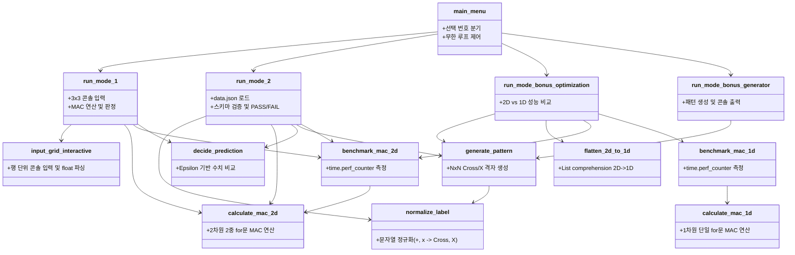

# 02. 제어 흐름(Control Flow) 및 데이터 흐름(Data Flow) 분석

본 문서는 Mini NPU Simulator가 실행되는 동안 함수들이 호출되는 순서(제어 흐름)와 데이터가 가공 및 변환되는 단계(데이터 흐름)를 인과관계 관점에서 상세히 설명합니다.

---

## 1. 전체 시스템 제어 흐름도 (System Architecture Flow)

프로그램의 시작점(`main.py` 진입)부터 메뉴 루프, 각 모드별 실행, 종료까지의 전반적인 제어 흐름은 다음과 같습니다:

```mermaid
flowchart TD
    Start([프로그램 시작: main.py]) --> MainMenu[메인 메뉴 루프: main_menu]
    MainMenu --> PromptInput[/사용자 메뉴 번호 입력 1~5/]
    
    PromptInput -->|1| Mode1[모드 1: run_mode_1]
    PromptInput -->|2| Mode2[모드 2: run_mode_2]
    PromptInput -->|3| Mode3[모드 3: run_mode_bonus_optimization]
    PromptInput -->|4| Mode4[모드 4: run_mode_bonus_generator]
    PromptInput -->|5 / q / exit| Terminate([프로그램 정상 종료])
    PromptInput -->|잘못된 입력| InvalidInput[경고 메시지 출력 후 재입력]
    InvalidInput --> MainMenu

    %% 모드 1 흐름
    subgraph Mode1_Detail [모드 1: 3x3 대화형 사용자 입력]
        Mode1 --> M1_Input[input_grid_interactive 호출: 필터A, 필터B, 패턴]
        M1_Input --> M1_Calc[calculate_mac_2d 호출: 점수 A, B 계산]
        M1_Calc --> M1_Bench[benchmark_mac_2d 호출: 10회 평균 연산 시간 측정]
        M1_Bench --> M1_Decide[decide_prediction 호출: Epsilon 기반 동점/우세 판정]
        M1_Decide --> M1_Print[콘솔 결과 출력: 점수, 판정, 소요시간]
    end
    M1_Print --> MainMenu

    %% 모드 2 흐름
    subgraph Mode2_Detail [모드 2: data.json 일괄 분석 파이프라인]
        Mode2 --> M2_Load[open & json.load: data.json 파싱]
        M2_Load --> M2_NormFilter[필터 라벨 정규화: normalize_label]
        M2_NormFilter --> M2_Loop[각 패턴 순회: size_N_idx 검증]
        M2_Loop --> M2_Validate{크기 및 필터 유효성 검증}
        M2_Validate -->|성공| M2_Calc[calculate_mac_2d: Cross/X 점수 산출]
        M2_Validate -->|실패| M2_LogFail[FAIL 기록 및 원인 메시지 저장]
        M2_Calc --> M2_Decide[decide_prediction: 예측 결과 도출]
        M2_Decide --> M2_Compare{예측 결과 == 정규화된 Expected?}
        M2_Compare -->|일치| M2_Pass[PASS 카운트 증가]
        M2_Compare -->|불일치| M2_Fail[FAIL 카운트 증가 & 상세 사유 저장]
        M2_Pass --> M2_NextPattern[다음 패턴으로 이동]
        M2_Fail --> M2_NextPattern
        M2_LogFail --> M2_NextPattern
        M2_NextPattern --> M2_Loop
        M2_Loop -->|순회 완료| M2_Bench[크기별 3x3~25x25 성능 벤치마크 수행]
        M2_Bench --> M2_Summary[종합 리포트 및 실패 케이스 목록 출력]
    end
    M2_Summary --> MainMenu

    %% 모드 3 흐름
    subgraph Mode3_Detail [모드 3: 2D vs 1D 메모리 최적화 벤치마크]
        Mode3 --> M3_Gen[generate_pattern: 크기별 3x3~100x100 패턴 생성]
        M3_Gen --> M3_Flat[flatten_2d_to_1d: 1차원 연속 배열로 변환]
        M3_Flat --> M3_Run2D[benchmark_mac_2d: 2D 루프 시간 측정]
        M3_Run2D --> M3_Run1D[benchmark_mac_1d: 1D 연속 메모리 시간 측정]
        M3_Run1D --> M3_Speedup[속도 향상비(Speedup) 계산 및 테이블 출력]
    end
    M3_Speedup --> MainMenu

    %% 모드 4 흐름
    subgraph Mode4_Detail [모드 4: 패턴 생성기]
        Mode4 --> M4_Input[크기 N 및 패턴 형태 1:Cross / 2:X 입력]
        M4_Input --> M4_Gen[generate_pattern: 격자 배열 생성]
        M4_Gen --> M4_Print[콘솔 2D 시각화 출력]
    end
    M4_Print --> MainMenu
```

---

## 2. 함수 호출 관계도 (Function Call Graph)

`main.py`에 정의된 각 함수들의 상호작용 및 의존 관계는 다음과 같습니다:



---

## 3. 데이터 생명주기 및 변환 파이프라인 (Data Pipeline)

외부 파일 `data.json`에서 읽어 들인 원시(Raw) 데이터가 사용자 콘솔에 결과 리포트로 도출되기까지 거치는 6단계 데이터 변환 과정은 다음과 같습니다:

```
[1단계: Raw JSON 파일]
  {"filters": {"size_5": {"cross": [[0.0, ...]], "x": [[...]]}}, "patterns": {"size_5_1": {"input": [...], "expected": "x"}}}
        │
        ▼ (json.load 파싱)
[2단계: Python Dict 구조체]
  filters_dict: Dict[str, Dict[str, List[List[float]]]]
  patterns_dict: Dict[str, Dict[str, Any]]
        │
        ▼ (normalize_label 적용)
[3단계: 정규화된 2D 매트릭스 및 라벨]
  normalized_filters["size_5"]["Cross"] = [[0.0, 0.0, 1.0, ...], ...]
  normalized_filters["size_5"]["X"] = [[0.1, 0.0, ...], ...]
  expected_label = "X"
        │
        ▼ (calculate_mac_2d 연산)
[4단계: 수치형 스칼라 점수 (Float Scores)]
  score_cross = 0.900000
  score_x     = 0.900000
        │
        ▼ (decide_prediction 판정)
[5단계: 판정 결과 튜플 (Decision Tuple)]
  decision = "UNDECIDED"
  reason   = "동점 (|Cross-X| = 0.00e+00 < 1e-09)"
        │
        ▼ (expected_label과의 일치 여부 비교)
[6단계: 최종 테스트 상태 및 리포트 (PASS/FAIL & Logs)]
  is_pass = (decision == expected_label) -> False
  status_str = "FAIL (동점 규칙 적용)"
```

---

## 4. 인과관계 요약

| 단계 (원인, Cause) | 동작/처리 로직 | 결과 (결과, Effect) |
| :--- | :--- | :--- |
| **외부 데이터의 이질적 라벨** | `normalize_label()` 호출 | `'+'`, `'cross'` $\rightarrow$ `'Cross'`<br>`'x'` $\rightarrow$ `'X'`로 통일되어 판정 분기 오류 원천 방지 |
| **사용자의 오타 또는 잘못된 크기 입력** | `input_grid_interactive()`의 `try-except` 및 `len()` 검증 | 비정상 종료 없이 오류 안내 메시지 출력 후 재입력 루프로 복구 |
| **미세한 부동소수점 오차** | `decide_prediction()`에서 `abs(A - B) < EPSILON` 검증 | 미세한 소수점 왜곡에 의한 오판정 방지 및 정밀 동점 처리 |
| **2차원 행렬 크기 증가 ($N=3 \rightarrow 25$)** | 2중 루프 `calculate_mac_2d()` 순회 | 연산 횟수가 $N^2$ 비율로 증가하여 소요 시간 상승 |
